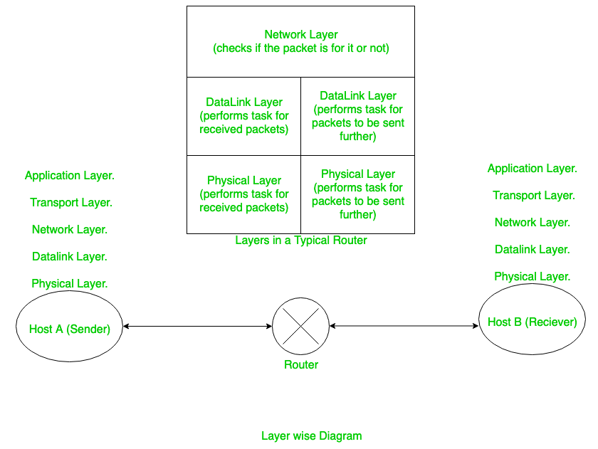
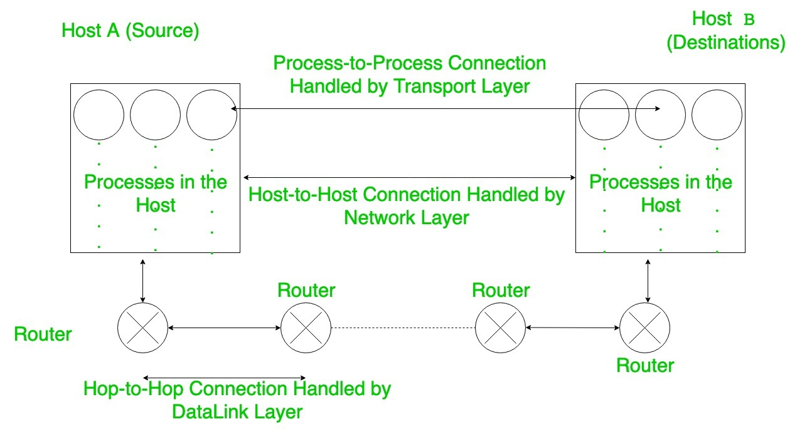

# Layers in ISO-OSI model

1. ***Physical Layer***:

    It deals with how our data, which are in bit are going to be get converted into be various kinds of signals and how these are to be transported among routers and hosts.
    
    It handles concepts like :
    
    **Transmission** – It means it handles if channels are simplex, half-duplex, Full duplex.

    **Topology** – It decides what is the topology of the network. For example: Bus Topology, Star Topology, Ring Topology, etc.
 
    **Encoding** – It decides what kinds of encoding is to be used to convert 0’s and 1’s into waves and send them across the channels. 
 
2. ***Data Link Layer***: 
   
    The major functions of data link layer are :

    **Flow Control** – Basically Flow control means the rate at which the sender is sending should be somewhat sunk with the rate at which receiver can receive and process the data. If a sink is not maintained then the data packets would get lost. These Flow Control also helps in determining the algorithm in which we will repeat the process of sending the lost packets. 

    It says which of the flow controls are to be used (S&W or GBN or SR).

    **Error Control** – Here the functions are implemented which help in error detection. The CRC (Cyclic Redundancy Check) algorithm is implemented here to detect the errors.
   
    **Framing** – The task of this is to put the packets (datagrams from Network layer) received from above layers into a frame and send it. These frames have a SFD(Starting Frame Delimiter) which alerts the routers that a new packet is coming. And these packets can even have a ED (End Delimiter) when we use variable length Frames saying that the packet is over.

    To mark this ED 2 strategies are used: Character Stuffing, and Bit Stuffing. 

    The DLL (Data link Layer) is itself divided into 2 parts: 

    - LLC (Logical Link Control) – Dealing mainly with Flow control and Error Control.
    - MAC (Medium Access control) – It deals with Framing, Access Control methods, Error Control (yes it also does), Physical Addressing.

3. ***Network Layer***: 

    This layer deals with the host-to-host connectivity, i.e., this layer is concerned about how packets are to be transferred without error from one host(sender) to other host(receiver). This layer uses the Logical Addressing which is unique for a device in the entire internet. 

    It also deals with the Switching of the packets to reach the desired host. The Switching of Packets is done by using the Routing Tables. 

        

    This Layer also performs the task of Congestion control. 

    Most important that this layer also performs is Fragmentation of packets. The Fragmentation, when the packets are to be transferred through a network which have less MTU (Maximum Transmission unit). Thus the datagrams are fragmented here so that they can be successfully transferred through that network. 

4. ***Transport Layer***: 

    This Layer handles the End-to-end connectivity it means this layer is important for the data packet to reach the exact port of the host . The Network Layer will bring the packet and give to host but the Transport Layer is the layer that helps the data packets to reach the designated port. 

    The other Functions of Transport layer are Flow Control (using SR protocol), Error Control, Segmentation, Multiplexing and demultiplexing, Congestion control. 

5. ***Session Layer***: 

    Mainly Deals with :

    - Authentication and Authorisation

    - Checkpointing

    - Synchronization

    - Logical grouping of operations (i.e., either all operations or no operations)

6. ***Presentation Layer***: 

    This layer Mainly Deals with :

    - Encryption and Decryption

    - Compression

    Now after learning the functions of the important layers. Now let’s see how it exactly works. Consider the case that we want to use GfG(GeeksforGeeks). Then when we start to send some data then after passing from initial layers (Application) the data will reach in Transport Layer where the port numbers of source and destination are added to the data packet. Then the packet is given to Network Layer and now this Layer will add source and destination IP addresses so that there would be proper communication between the sender and receiver. 

    After that the Packet is given to Data Link Layer where the MAC addresses of source and destination are added. 

    Now an important thing to note is that initially by Logically ANDing the Subnet mask and Destination IP address we try to find to that if we have an entry for the destination network. If no entry is present in routing table then we use the mac address of the default gateway (router) as the destination mac address. Now to find the MAC address of the router the host sends ARP request so that it receive the MAC address. 

    ARP (Address Resolution Protocol) request is like saying please send me your MAC address whose IP address is this (Logically). 

    In the Data Link Layer, sometimes also the Fragmentation is performed so that packet can fit into the network’s MTU (as explained earlier). 
 
    

    After all this data-packet is given to Physical Layer and is transported. 

    Now when the packet reaches the router (whose mac address was written in the packet) the router accepts that packet then removes the headers and give to Network Layer of that Router and there it checks if the packet is for it or someone else by checking the destination ip in the router. Then again the above mentioned process of DLL is performed again by the router. This process is repeated until the packets reach the Destination Network. 

    On Reaching the Destination Host DLL removes the headers and give the data packet to NL then the NL finds that the packet is for it. Thus, the data is given to the designated port of the Host. And thus finally after receiving the packet successfully the Transport Layer sends an acknowledgment to the Host that packet has been successfully delivered and this acknowledgment sent back will go through the exact steps mentioned above. 

    The router’s Data link Layer also give acknowledgments after receiving the packet packets.
 